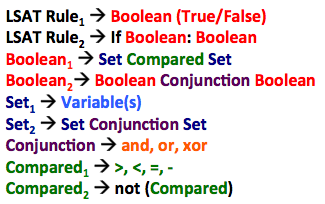
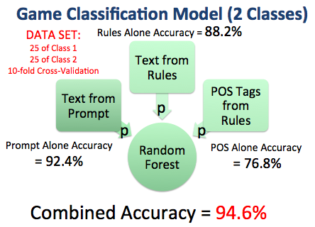
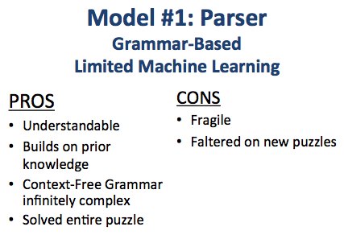
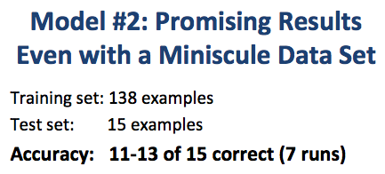

# **Solving LSAT Logic Games: A Tale of Two Models** ##

## Objective
The Law School Admissions Test (LSAT) includes a section on [analytical reasoning](http://www.lsac.org/jd/lsat/prep/analytical-reasoning) that asks test takers to solve logic puzzles.  The immediate goal of this project was to solve some of those puzzles and to answer LSAT questions about them.  By testing two different solutions to the problem, however, the project also explores larger questions about the roles that deep learning and linguistic expertise are likely to play in the future of Natural Language Processing (NLP).

## Motivation
Within NLP, semantic parsing or natural language understanding remains largely an unsolved problem.  Aside from corpuses too vast for humans to read comfortably, the reading comprehension skills of the best NLP systems typically lag far behind those of humans.  This project explores the possibility that, even on a tiny corpus where size poses no challenge to a human reader, algorithms can sometimes outperform humans.  It also investigates two different approaches to semantic parsing: one based very loosely on syntactic parsers like Parsey McParseface (the product of research at Stanford and Google) and the other based on Seq2Seq, Google's state-of-the-art neural machine translation (NMT) library.

## Data
My data consists of questions and answers from actual LSAT examinations.  Because those materials are copyrighted by the company that produces them, I have not included my data set in this repository.  Nor was I able to train my models on the entire corpus of publicly available LSAT tests.  For these initial prototypes, my data set was limited to a set of 50 puzzles (25 sequencing-type games and 25 grouping-type games).  When training a model to classify LSAT games as either sequencing or grouping puzzles, I trained on 45 games and held out 5 sets for testing.  For purposes of parsing the logical rules that accompany each game, I trained on a set of 153 labeled rules, with 138 rules in the training set and 15 in the test set.

##  The Seven Steps of the Puzzle-Solving Process
To answer LSAT questions about logic games, seven steps must be performed, whether the puzzle solver is a human or a machine.  Below, I describe how I approached each of these steps:

### Step 1: Classify the Game
Because most LSAT puzzles fall into one of two basic categories, sequencing games or grouping games, the solver's first task is to read the game's initial prompt and rules to determine which type it represents: a sequencing game, where the goal is to determine the permissible orderings for a set of variables, or a grouping game, where the object is to determine which variables may or may not belong within different sets.

I approached this step by building a stacked model, consisting of three linear classifiers, each of which feeds into a second-level random forest model.  Each of the three linear classifiers utilizes a different data source:

  1) the tokenized text of the prompt
  2) the tokenized text of the rules
  3) the Part of Speech (POS) tags for the rules

Each of these three models independently generates a probability that the game in question should be classified as a sequencing game.  Those three outputs are, in turn, fed into a random forest model that produces a final prediction.  Although I ran some grid searches to independently tune each component model, I did not test other configurations or classification models because my primary focus remained on Step 3 (below): parsing the logical rules that render the subsequent questions answerable.  In the future, I would nevertheless like to test Convolutional Neural Nets (CNN) for Step 1 because they have shown great promise as textual classifiers.

Note, too, that the remaining steps of my model(s) presuppose that the game represents a sequencing puzzle.  Given that my primary goal was to build prototypes of different models, I limited myself to one type of game (which comprises almost half of the LSAT logic games).

### Step 2: Set Up the Game
While I could have deployed spaCy's Named Entity Recognizer to identify the variables referenced in the prompts, I instead used spaCy's POS tagger and then extracted lists of the variable names from the prompts based on those POS tags and on the commas used to separate them.  Although my code can successfully handle various formats--such as compound variable names (most are single word or even a single letter) and lists that do or do not include the word "and" before the final element--I was not overly concerned with constructing a robust solution for this step of the problem.  

In addition, Step 2 populates a list of all the conceivable sequences of variables (before any rules have been applied to winnow that pool of candidates).  In other words, the initial pool consists of X factorial candidates, where X is the number of variables.  Thus, a game with 9 variables generates an initial pool of 9! = 362,880 permutations.

### Step 3: Parse the Rules
Step 3 represents the most challenging and interesting part of this project: What is the best way to convert an English-language statement of a logical rule into a Boolean expression that can be evaluated by Python's compiler (to produce a True or False result when tested on a candidate sequence of variables)?

This problem can be conceptualized in two different ways:

1) as a semantic parsing problem (for which a syntactic parser like Parsey McParseface provides a useful analogy)

2) as a translation problem, where the source language is English and the target language is Python (the neural nets that Google developed to perform Machine Translation provide one solution)

This project thus afforded me an opportunity to learn more about Google's state-of-the-art solutions to these two different problems, and challenged me to consider--as both a practical and a theoretical matter--which approach would work best for my problem.  To test both options, I constructed a model for each.

#### Model #1: The Semantic Parser
The most interesting part of building the Parser was working out the unique grammar that governs the LSAT's sequencing games and considering how best to translate those sentence structures into a syntax that can be read by Python's compiler.  With the aid of LSAT test prep materials produced by companies like PowerScore and Kaplan, I discovered that the structures defining LSAT sequencing rules constitute a Context-Free Grammar.  

A Context-Free Grammar defines the ways in which grammatical units can be decomposed into other grammatical units.  They are context-free because a unit's permissible decompositions are not affected by its surrounding context.  All LSAT sequencing rules, for example, take one of two forms.  They either consist of a Boolean expresion like A>B, or they form a conditional statement like: if A>B, then B>C. In other words, every LSAT rule can be decomposed in one of those two ways.  But the Boolean expressions that define those two, still-generic types of sentence can themselves be decomposed in different ways.  A might be greater than B, less than B, equal to B, not equal to B, etc.  Nevertheless, each of those different comparisons takes the same form: _(Set of Variables) (Some Kind of Comparison) (Another Set of Variables)_.  So that structure represents one way of decomposing a Boolean.  But it's not the only way.  A Boolean might also be decomposed into still more Booleans: ((A>B) and (A>C)).  

In fact, there is in theory no limit to the number of times that a Boolean can be decomposed in this somewhat self-referential, nested manner.  We could utilize these same CFG rules to write (((A and D> B) and (A>C)) or ((A and D)<B) and (A<C)).  CFG's are thus powerful for the same reason that recursive functions are powerful: they enable you to combine and nest operations as many times as you want.  Through recursion, a finite set of grammatical operations becomes capable of generating an infinite variety of grammatical structures.  

In comparison to the extraordinary richness and diversity of ordinary English sentences, the possibilities for LSAT rule statements remain very narrowly circumscribed.  Whereas the CFGs used to train the state-of-the-art syntactical parsers produced by Stanford and Google must accommodate thousands of permissible CFG transformations/decompositions, only nine CFG transformations are needed for my problem:

Those 9 CFG transformations are nevertheless capable of generating an infinite variety of logical/grammatical structures.  And, given more time, I would have preferred to implement those 9 rules within a properly recursive parser, capable of nesting structures many layers deep.  Such a model could, in theory, handle any number of branches and any level of depth.  Armed with fully recursive capabilities, a machine parser could likely outperform humans on complicated logical structures.

For purposes of handling the types of questions that typically appear on actual LSAT examinations, however, such recursive structures were largely unnecessary.  The rules that define most LSAT puzzles are relatively straightforward.  If one conceptualizes LSAT rules as CFG's, one discovers that most rules can be parsed using only a handful of CFG expansions; the corresponding grammatical trees typically run only two to four layers deep.  My Parser adds a pair of parentheses each time it applies a CFG expansion, yet its Python output rarely contains more than three or four nested sets of parentheses.  More importantly, the LSAT rarely requires the same CFG transformation more than once for given LSAT rule.  As a result, I was able to obtain relatively robust results even without implementing a genuinely recursive, full-featured parser.  

For purposes of prototyping, I used a much simpler model, which assumes limited nesting and relies on crude textual heuristics when applying the CFG transformations.  By expanding the number of those heuristics (crafting an ever-longer set of if-then alternatives), one could, of course, readily expand the model's reach.  But without proper recursion or any machine learning, such heuristics remain exceedingly fragile and limited in scope.  And even with recursion, the task of devising appropriate heuristics remains labor-intensive at best and completely ungeneralizable at worst.

#### Model #2: The Translator (Seq2Seq)
Precisely for that reason, I built a second model harnessing the incredible power and flexibility of neural nets.  Instead of painstakingly crafting a complex web of if-then heuristics, why not outsource that task to a neural net?  Specifically, why not see if one of the most promising new tools in NLP deep learning--Google's Seq2Seq--can be trained to transform English sentences into Python code entirely on its own?  Although Seq2Seq was initially created with natural language translation in mind, many researchers are already busy exploring its potential applicability in other contexts, including (at Google itself) image captioning and content summarization.  Indeed, my doubts about Seq2Seq's viability in the context of translating English to Python stemmed less from its inherent power than from my own ability, given the time constraints of this project, to hand label a sufficiently large training set.  Would 138 examples be enough for Seq2Seq to replicate my own attempts to map out the grammar governing the LSAT's sequencing games?

#### Step 4: Apply the Rules to Winnow the Pool of Possible Solutions to the Game  
Step 4 simply takes the set of logical rules extracted in Step 3 and applies those rules to the set of permutations that was generated in Step 2.  For example, if one of a game's rules dictates that variable A must come after variable B, one would expect (putting aside any additional constraints) that half of the original permutations would pass that test and half would fail.  A game with 9 variables would start off with 362,880 conceivable permutations.  But if one of the game's rules mandates that A must come after B, then only 181,440 permutations will survive application of that initial rule.  And if a second rule requires that B come after C, then another half will be eliminated.  

For most games, application of game's initial set-up rules will winnow the pool of permissible solutions to fewer than 100 candidates.  On occasion, however, the set of acceptable candidates might include only a dozen or so permutations.  

#### Step 5: Parse the Questions  
Precisely because the pool of candidates emerging from Step 4 typically includes more than a dozen permissible orderings, many LSAT questions begin by imposing additional constraints that apply only in the context of that particular question.  Such questions are sometimes said to impose 'local' rules, as opposed to the 'global' rules parsed in Step 4.  To handle these local rules, Step 5 checks to determine whether the question begins with 'If...' or with a verb like 'Assume that...' since those are the ways that the test makers typically flag the appearance of a local rule.  

In addition to looking for local rules, one must also determine what kind of information the so-called 'question stem' seeks.  Most often, solvers are asked to determine what "must be true", "must be false", "could be true", or "could be false", but various negations like "CANNOT be true" and exceptions like "could be false EXCEPT" must also be accommodated, along with a handful of more esoteric types.  Again, since Step 3 absorbed most of my attention, I did not implement functions to handle the less common question types; I concentrated on the most frequent types.

#### Step 6: Parse the Multiple Choice Answers
Like the LSAT's questions, the answers require some understanding of their potential formats.  Here, too, I relied on my domain knowledge respecting those formats to hard-code some straightforward parsing heuristics.  Just as human test takers quickly learn that an "If..." question imposes an additional, local rule on the game, so too do they quickly learn to recognize the potential answer formats.  Most of the answers consist of lists of variables (which require only rudimentary processing) or sentences (which require handling by the more sophisticated models connected to Step 3).  But, for my prototyping purposes, I again found it unnecessary to tackle the more obscure answer formats; I stuck to the types that define 90% of the LSAT's games.

#### Step 7: Pick the Correct Answer
The final step of the process is identifying the correct answer from among the 5 multiple-choice candidates.  Here, both humans and machines must carefully keep in mind the nature of the question being asked and test each answer with that particular question-type in mind.  Am I searching for an answer that "could be true", "could be false EXCEPT", etc.? 

## Results
### The Classification Problem from Step 1 
As described above, I was not overly concerned with getting great results on Step 1.  My initial efforts yielded 94% accuracy, which was sufficient to get me started:  

### Step 3-Model #1: Using Grammar-Based Heuristics to Parse Rules
As described above, my grammar-based, heuristic parser remains very crude since it does not include the recursive functionality that would render it a proper parser.  Even without any machine learning or recursion, however, my algorithm sufficed to parse many of the rules because the nesting typically only involves a handful of CFG transformations and thus a handful of nested layers.

### Step 3-Model #2: Using Seq2Seq to Translate Rules from English into Python
For my Seq2Seq model, I simply adapted one of the architectures provided by Google in an example.  Although I played with a few of the parameters, like bucketing and batch size, I was unable to improve on the out-of-the-box results produced by Seq2Seq's default settings for its attention-based model.  Understanding the different parameters, models, and architectures associated with Seq2Seq will take some time.  As Google provides additional tutorials and as others begin to explore these new tools (which are, after all, only 2 months old), the community of people experimenting with them will no doubt grow.  For purposes of this project, I was happy simply to get a sense of Seq2Seq's power:

The most remarkable aspect of my results was not their (mediochre) accuracy, but evidence that Seq2Seq was genuinely learning and not merely memorizing.  After mapping Seq2Seq's integer outputs back onto my original vocabulary, I discovered that Seq2Seq was sometimes generating labels that were different from mine, but equally valid.  In other words, it was creatively generating alternative solutions.
In my labels, for example, I used abs(A-B)==x to express the difference between A and B.  Seq2Seq took a different approach.  It treated A>B and B<A as separate cases: (((B-A)==x) or ((A-B)==x)).  Its solution was thus equally valid and equally effective, but nevertheless different from the exact labeling system on which it was trained.  I was amazed that Seq2Seq was able to learn so much from only a small training set of 138 examples.  Its ability to generalize beyond the examples provided to it was truly impressive and stands in stark contrast to the fragility of my hand-crafted parsing model.

## Concluding Question: Is Grammar Dead?

Some might conclude from this little experiment that linguistic expertise has little to offer NLP and that today's best neural nets can easily infer whatever patterns a human linguist is capable of identifying.  It is interesting to note, however, that Google does not take this view.  The best performing syntactic parsers in the world, Parsey McParseface and its siblings in Google's SyntaxNet project, continue to rely on Context-Free Grammars devised by human linguists.  And while some researchers at Google have achieved impressive results building syntactic parsers without any CFG's whatsoever (substituting enormous, synthetically generated training sets of 11M labeled sentences!), Google continues to invest heavily in tools that both exploit and increase our understanding of syntax.  Google is not yet convinced that grammar is dead, and neither am I.

## References
### Textbooks
[_Foundations of Statistical Natural Language Processing_](https://nlp.stanford.edu/fsnlp/)  
Christopher D. Manning, Prabhakar Raghavan and Hinrich Schütze

[_Speech and Language Processing_](https://web.stanford.edu/~jurafsky/slp3/)  
Dan Jurafsky and James Martin

[_Introduction to Information Retrieval_](https://nlp.stanford.edu/IR-book/)  
Christopher D. Manning, Prabhakar Raghavan and Hinrich Schütze

### Articles
[Globally Normalized Transition-Based Neural Networks](https://static.googleusercontent.com/media/research.google.com/en//pubs/archive/45377.pdf)  
Daniel Andor, Chris Alberti, David Weiss, Aliasksei Severyn, Alessandro Presta, Kuzman Ganchev, Slav Petrov and Michael Collins

[Neural Machine Translation by Jointly Learning to Align and Translate](https://arxiv.org/pdf/1409.0473.pdf)  
Dzimitry Bahdanau, KyungHyun Cho, Yoshua Bengio

[Grammar as a Foreign Language](https://arxiv.org/pdf/1412.7449.pdf)  
Oriol Vinyals, Lukasz Kaiser, Terry Koo, Slav Petrov, Ilya Sutskever, Geoffrey Hinton

[Improved Semantic Representations From Tree-Structured Long Short-Term Memory Networks](https://arxiv.org/pdf/1503.00075.pdf)  
Kai Sheng Tai, Richard Socher, Christopher D. Manning

### Courses Covering Parsing and Machine Translation
[Natural Language Processing (Columbia)](http://www.cs.columbia.edu/~cs4705/)    
Michael Collins

[Natural Language Processing with Deep Learning (Stanford)](http://web.stanford.edu/class/cs224n/)    
Richard Socher and Chris Manning
